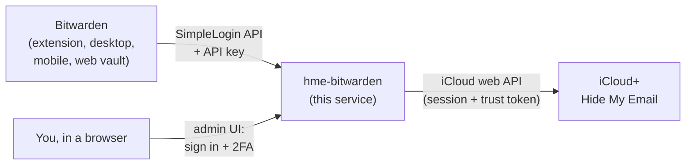

# HME for Bitwarden

**Use iCloud+ Hide My Email as an email forwarder in the Bitwarden username generator.**

[](https://github.com/charaktermaske/hme-bitwarden/actions/workflows/ci.yml)

[](LICENSE)

Bitwarden can create email aliases with SimpleLogin, addy.io, Firefox Relay, DuckDuckGo, Fastmail and
ForwardEmail, but not with Apple's Hide My Email, because Apple offers no public API for it.

This small self-hosted service closes the gap. It speaks the same API as a self-hosted **SimpleLogin**
(and **addy.io**) server, so Bitwarden can use it today without any plugin or modified client. Behind the
scenes it creates a real `@icloud.com` Hide My Email address in your iCloud account and labels it with the
website you are signing up for.



> [!WARNING]
> This project uses the **private** web API that icloud.com itself uses (via
> [pyicloud](https://github.com/timlaing/pyicloud)). Apple can change it at any time, and automated use may
> conflict with Apple's terms of service. Use it at your own risk. It is not affiliated with Apple or
> Bitwarden.

## Features

- **Works with every Bitwarden client:** browser extension, desktop, iOS/Android and the web vault, as a
  "Forwarded email alias" of type SimpleLogin (or addy.io).
- **Real Hide My Email addresses:** they appear in your iCloud settings and can be deactivated there,
  labeled with the website (e.g. `shop.example.com`).
- **Sign in once with 2FA:** the session and Apple's trust token are reused and refreshed automatically.
- **Your Apple ID password is never stored.** It stays in memory only, until the container restarts.
- **Notifications** (ntfy or any webhook) when Apple ends the session and you need to sign in again.
- **Secure by default:** constant-time token checks, brute-force lockout, CSRF protection, strict CSP,
  non-root read-only container, its own hourly limit on new addresses.

## Requirements

- An **iCloud+** subscription (Hide My Email is part of it) and an Apple ID with two-factor authentication
  via trusted devices or SMS. Hardware security keys are not supported.
- A server with **Docker**, reachable by all devices you use Bitwarden on.
- A domain name and a **reverse proxy with HTTPS** (Caddy, Traefik, nginx, ...).

## Quick start

```bash
git clone https://github.com/charaktermaske/hme-bitwarden.git
cd hme-bitwarden
cp .env.example .env
```

Edit `.env` and set at least:

```bash
HME_API_TOKEN=$(openssl rand -hex 32)       # the key you will paste into Bitwarden
HME_ADMIN_PASSWORD=<a long password>         # protects the admin UI
HME_PUBLIC_URL=https://hme.example.com
```

Start the container:

```bash
docker compose up -d --build
docker compose logs -f
```

The example compose file publishes the service on `127.0.0.1:8000`, so it is only reachable through a
reverse proxy on the same host. Point your proxy at it (see below), then open `https://hme.example.com`.

## Reverse proxy

The service must be served over HTTPS. Bitwarden only needs the paths under `/api/`; everything else is
the admin UI.

**Caddy** (built-in admin login):

```caddyfile
hme.example.com {
    reverse_proxy 127.0.0.1:8000
}
```

**Caddy with an SSO portal** such as Authelia. Set `HME_ADMIN_AUTH=proxy` so the service skips its own
login, and keep `/api/*` outside the SSO because Bitwarden authenticates with the API key:

```caddyfile
hme.example.com {
    @api path /api/*
    handle @api {
        reverse_proxy hme-bitwarden:8000
    }
    handle {
        forward_auth authelia:9091 {
            uri /api/authz/forward-auth
            copy_headers Remote-User Remote-Groups Remote-Email Remote-Name
        }
        reverse_proxy hme-bitwarden:8000
    }
}
```

**nginx:**

```nginx
server {
    listen 443 ssl;
    server_name hme.example.com;
    # ssl_certificate ...;

    location / {
        proxy_pass http://127.0.0.1:8000;
        proxy_set_header Host $host;
        proxy_set_header X-Forwarded-For $proxy_add_x_forwarded_for;
        proxy_set_header X-Forwarded-Proto $scheme;
    }
}
```

Set `HME_TRUSTED_PROXIES` to the address or network your proxy connects from, so the service sees real
client IPs for its brute-force protection. The default is `127.0.0.1`; behind a proxy in a Docker network
use e.g. `172.16.0.0/12`.

## Sign in to iCloud

1. Open `https://hme.example.com` and log in with `HME_ADMIN_PASSWORD` (or through your SSO).
2. Enter your Apple ID and password, then the six-digit code Apple sends to your devices.
3. The page shows **Signed in as …**. The session is now stored in the `/data` volume.

Apple ends sessions from time to time. When that happens, Bitwarden shows
*"iCloud: … Sign in again at https://hme.example.com"* and, if configured, you get a notification. Sign in
again on the admin page; your existing addresses are not affected.

## Configure Bitwarden

In any Bitwarden client:

1. **Generator** → **Username** → type **Forwarded email alias**
2. Service: **SimpleLogin**
3. **Server URL** (self-hosted): `https://hme.example.com`
4. **API key**: the value of `HME_API_TOKEN` (also shown on the admin page)

Generate a username, and a new `@icloud.com` address appears, labeled with the current website. The
settings are per client, so repeat them in each app you use.

<details>
<summary>Using the addy.io integration instead</summary>

Choose **Addy.io**, enter the same server URL and API key, and any value as the email domain (for example
`icloud.com`; it is ignored). The label is taken from the website in Bitwarden's description.

</details>

## Configuration

All settings are environment variables. Every secret can be read from a file instead by appending
`_FILE` to its name (for example `HME_API_TOKEN_FILE=/run/secrets/hme_api_token`).

| Variable | Default | Description |
|---|---|---|
| `HME_API_TOKEN` | *required* | API key for Bitwarden, at least 32 characters |
| `HME_ADMIN_AUTH` | `password` | `password` uses the built-in login; `proxy` relies on your reverse proxy to protect everything except `/api/` |
| `HME_ADMIN_PASSWORD` | *required with `password`* | Admin UI password, at least 12 characters, different from the API key |
| `HME_PUBLIC_URL` | | Public HTTPS URL, used in error messages and notifications |
| `HME_TRUSTED_PROXIES` | `127.0.0.1` | Comma-separated IPs/CIDRs allowed to set `X-Forwarded-*` headers |
| `HME_COOKIE_SECURE` | `true` | Send the admin session cookie over HTTPS only; set `false` only for local HTTP testing |
| `HME_SESSION_SECRET` | *generated* | Key that signs admin sessions; generated once and stored in `/data` if unset |
| `HME_MAX_ALIASES_PER_HOUR` | `10` | The service's own hourly limit on new addresses |
| `HME_KEEPALIVE_INTERVAL` | `21600` | Seconds between session refreshes (minimum 300) |
| `HME_NTFY_URL`, `HME_NTFY_TOPIC`, `HME_NTFY_TOKEN` | | Send a notification to [ntfy](https://ntfy.sh) when you need to sign in again |
| `HME_WEBHOOK_URL` | | Also POST `{"title", "message", "url"}` as JSON to this URL |
| `HME_DATA_DIR` | `/data` | Where the session is stored |
| `HME_HOST`, `HME_PORT` | `0.0.0.0`, `8000` | Listen address |
| `HME_LOG_LEVEL` | `INFO` | `DEBUG`, `INFO`, `WARNING`, ... |
| `HME_ACCESS_LOG` | `false` | HTTP access log; off by default because URLs contain the websites you create addresses for |

## Security

- **What is stored:** only the iCloud session (cookies and Apple's trust token), the Apple ID name and a
  signing key, in `/data` with permissions `0700`/`0600`. **Treat this volume like a password:** anyone with
  it can access your iCloud account until the session expires. Signing out in the admin UI deletes it.
- **What is not stored:** your Apple ID password. pyicloud keeps it in memory so it can renew an expired
  session token without asking for 2FA, as long as Apple's trust token is valid.
- **API:** the key is compared in constant time; after 10 failed attempts within 15 minutes a client is
  blocked. A leaked key lets someone create addresses in your account, up to `HME_MAX_ALIASES_PER_HOUR`.
  Rotate it by changing `HME_API_TOKEN` and updating Bitwarden.
- **Admin UI:** password login or your SSO, `SameSite=Strict` HTTP-only session cookie, CSRF tokens on all
  forms, `Content-Security-Policy: default-src 'none'`, no JavaScript at all. CORS headers are only sent for
  `/api/`.
- **Container:** unprivileged user, read-only root filesystem, all capabilities dropped,
  `no-new-privileges`.

See [SECURITY.md](SECURITY.md) to report a vulnerability.

## Troubleshooting

| Bitwarden shows | Meaning and fix |
|---|---|
| `Invalid API key` | The key in Bitwarden does not match `HME_API_TOKEN`. |
| `iCloud: Not signed in yet` / `session expired` | Sign in on the admin page. |
| `Hourly alias limit reached` | The service's own limit; raise `HME_MAX_ALIASES_PER_HOUR` or wait. |
| `iCloud: <message from Apple>` | Apple refused the request, e.g. because too many addresses were created recently. Wait and retry. |
| `Too many failed attempts` | This client sent wrong keys or passwords repeatedly; wait 15 minutes. |
| Unknown error / network error | Check that the server URL is reachable over HTTPS from that device and look at `docker compose logs`. |

If sign-in fails after Apple changed something, update pyicloud (see `pyproject.toml`) and rebuild the image.

## Development

```bash
python -m venv .venv
source .venv/bin/activate          # Windows: .venv\Scripts\activate
pip install -e ".[dev]"

pytest                             # tests use fakes, nothing talks to Apple
ruff check . && ruff format --check .

# run locally over plain HTTP
HME_API_TOKEN=$(openssl rand -hex 32) HME_ADMIN_PASSWORD=change-me-please \
HME_DATA_DIR=./data HME_COOKIE_SECURE=false hme-bitwarden
```

Project layout:

```
src/hme_bitwarden/
├── __main__.py     entry point, starts uvicorn
├── app.py          application factory, middleware, keep-alive thread
├── config.py       settings from environment variables, validation
├── icloud.py       iCloud sign-in, 2FA, session reuse, Hide My Email calls (all pyicloud usage)
├── aliases.py      labels, hourly limit, recent history
├── bitwarden.py    SimpleLogin- and addy.io-compatible API endpoints
├── web.py          admin UI routes
├── security.py     token checks, brute-force limiter, CSRF, security headers
├── notify.py       ntfy and webhook notifications
├── templates/      Jinja2 templates
└── static/         stylesheet
```

## License

[MIT](LICENSE). iCloud, Hide My Email and Apple are trademarks of Apple Inc. Bitwarden is a trademark of
Bitwarden Inc. This project is not affiliated with either.
